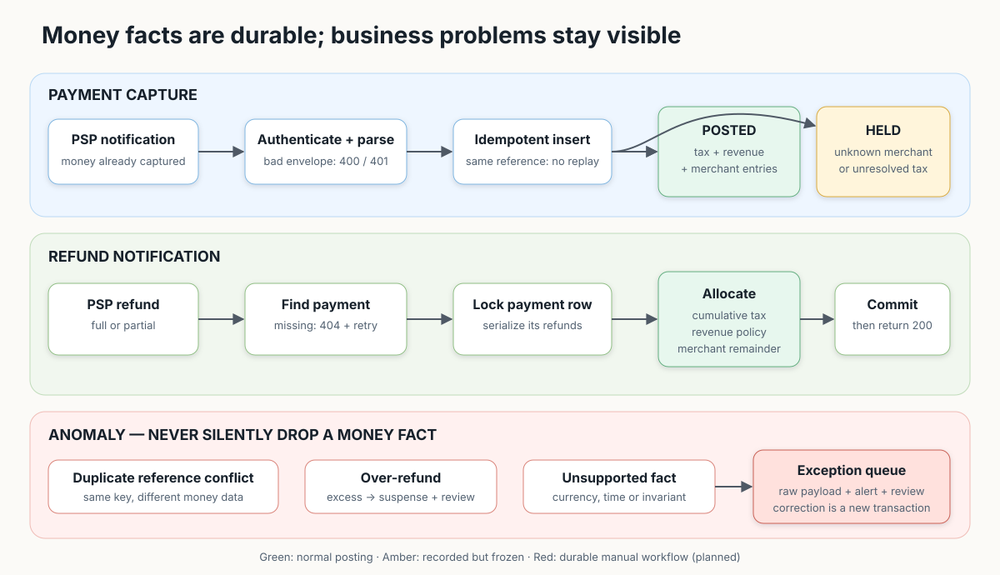
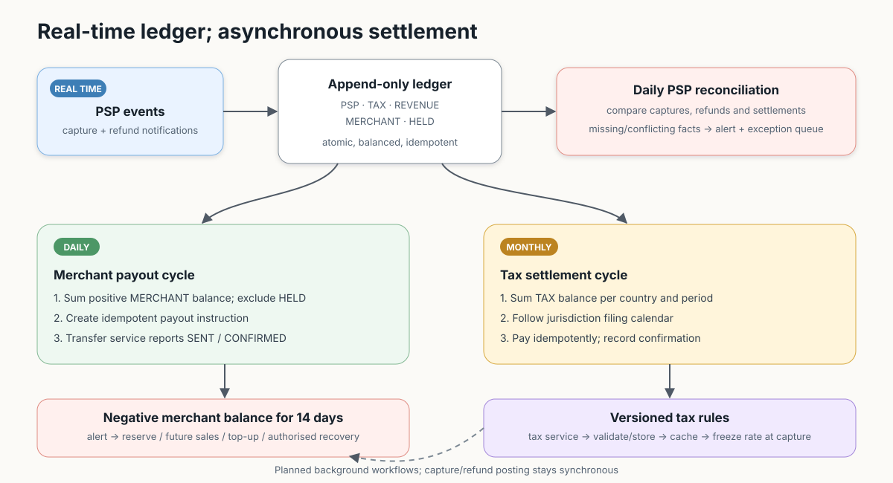

# Business rules for MoR ledger service

This document explains the business behaviour of the Merchant of Record (MoR)
ledger service.

## Service architecture assumptions

- The ledger receives PSP notifications and must not lose valid money events.
- The PSP has already moved customer money. The ledger records that fact.
- Customer eligibility and refund decisions happen before the ledger.
- The ledger still owns tax, revenue and merchant accounting allocation.
- One currency (EUR) but several countries with different taxes (one country - one tax).
- Full and partial refunds keep MoR revenue; returning it by reason is a later step.
- Unknown merchant or tax data is saved as `HELD` and queued for manual review.
- A negative merchant balance is carried forward. Alert after 14 days.
- Production errors need a durable exception queue and manual resolution.
- Fraud operation just alerting - not skipped

## Payments

An authenticated, readable capture is accepted because the customer was already
charged.

| Event                          | Result                                                 |
|--------------------------------|--------------------------------------------------------|
| Known merchant and tax         | `SUCCESS`: tax + MoR revenue + merchant balance        |
| Unknown merchant or tax        | Save as `HELD`; write an exception; manual review      |
| `success = false` at the PSP   | Return `200`; write nothing                            |
| Exact retry                    | Return `200`; write nothing                            |
| Same reference, different data | Keep the first event; write an exception; no second row |
| Bad signature/body             | Return `401`/`400`                                     |

The merchant allowlist is empty until `mor.merchant` is read, so every capture
is `HELD` today. The rule is implemented; the source of merchants is not.

## Refunds

A successful refund is also an existing money fact. Full, partial and multiple
refunds are supported.

| Event                               | Result                                                                 |
|-------------------------------------|------------------------------------------------------------------------|
| Missing payment                     | Return `404`; retry after payment arrives                              |
| Exact retry                         | Return `200`; write nothing                                            |
| Same reference, different data      | Keep the first event; write an exception; no second row                |
| Total refunds exceed payment amount | Save full refund; close payment; post excess to `SUSPENSE`; write an exception |
| Bad signature/body                  | Return `401`/`400`                                                     |

| Revenue policy   | Partial refund                  | Full refund   | Today                         |
|------------------|---------------------------------|---------------|-------------------------------|
| Keep fee         | Merchant funds refund after tax | Keep full fee | Always                        |
| Return fee       | Return proportional fee         | Return full fee | Not implemented - see below |

Returning the fee depends on who is at fault, and the `reason` in the webhook
body cannot carry that: the signature proves the PSP sent it, not who wrote it.
Production takes the reason from the MoR's own refund service. `fee_returned`
is stored per refund, so switching later never rewrites history.

For an over-refund, return `200` after saving three linked facts: the complete
refund, balanced ledger entries with the excess in `SUSPENSE`, and
a manual exception. Tax, revenue and merchant balances are never reversed past
their original amounts. An operator later moves suspense to PSP receivable,
merchant receivable or MoR loss with a new ledger transaction, then deletes the
exception row. Implemented: the refund, the `SUSPENSE` entries and the exception
row. Not implemented: the operator action that clears them.

## Balances

Two read-only reports over the ledger. Neither writes anything, and both are a
`SUM` over `ledger_entry`, which carries its own `occurred_at` so no join is
needed.

Each report answers from **one database snapshot**. The tax report is a single
statement using aggregate `FILTER`s; the merchant report runs its two
statements inside a `REPEATABLE READ READ ONLY` transaction. Split across
separate `READ COMMITTED` statements, a capture landing mid-report could
produce a `movement` matching neither endpoint.

`occurred_at` is the **tax point** - `paymentTime` for a capture, `refundedAt`
for a refund - not when the row was written. A sale on 31 August belongs to
August even if the webhook arrived in September.

Because the tax point decides the period, future dates are bounded:
`refundedAt` must be at or after `paymentTime` and no more than 2 days ahead
of now (`RefundService.MAX_FUTURE_DRIFT`), otherwise the refund is
`INVALID_DATE` in the error table. Captures allow 7 days either way
(`PaymentService.MAX_DATE_DRIFT`) and only warn.

| Report | Question | Caller |
|--------|----------|--------|
| `GET /v1/balances/tax` | What does one country's tax authority get, over a filing period? | Accounting, filing the return |
| `GET /v1/balances/merchants` | What is owed to merchants right now? | MoR operations |

### Tax, per country, per period

`country` is required; `from` and `to` are optional. Without them the answer is
the balance now. With them it is a filing period:

| Field | Meaning |
|-------|---------|
| `owedAtStart` | Owed immediately before the window |
| `movement` | Change inside it: sales add, refunds and remittances subtract |
| `owedAtEnd` | Owed at the end - the number the return is filed for |

One country per call. A tax return is filed per country, so a caller preparing
a return asks for one; batching is a list parameter on the same query and is
left until there are enough countries to justify it.

### Merchant balances

`available` is payable on the next payout run. `held` is recorded but frozen
and never paid out. Repeating `merchantId` asks for several, at most 100 per
call; omitting it pages through everyone with a balance.

Paging is keyset, not offset: pages are ordered by merchant id, capped by
`limit` (default 100, max 500), and continued by passing the response's
`nextCursor` back as `after`. Cost per page is constant, so an unfiltered call
can never aggregate the whole ledger into one response.

Without `date` the answer is the live ledger balance up to `asOf`, which
defaults to now. `occurred_at` is the tax point, and a capture is accepted with
a tax point up to `MAX_DATE_DRIFT` (7 days) in the future, so without the
cutoff a sale dated next week would read as `available` while the payout job
correctly withholds it. Passing the echoed `asOf` back pins every page of a
walk to one instant. With `date` it is that
day's close, read from `merchant_daily_balance` - one indexed row instead of a
sum, and the number the payout job acted on, which is what a dispute is about.

Two limits of the snapshot: there is no row for a day the close job did not
run, and it records the merchant balance only, so `held` is absent for a past
date.

### Not implemented

Full list in README.md, "Production TODOs".

- **Merchant activity statement**: captures, refunds and payouts between two
  dates. Same data, grouped by `ledger_transaction.type`.
- **Auth.** These are not PSP endpoints, so the webhook signature does not
  apply. They are open today; production needs its own scheme for the finance
  client and, if merchants ever call directly, a rule that a merchant can only
  read its own balance.

## Settlement and controls

| Process                   | Rule                                                 | Status      |
|---------------------------|------------------------------------------------------|-------------|
| Merchant payout           | Daily positive balance; exclude `HELD`; fixed cutoff | Implemented, mock PSP client |
| Negative merchant balance | Carry forward; alert after 14 days                   | Detection implemented; recovery planned |
| Tax settlement            | Pay per country, monthly on the 5th for the month before | Implemented, mock authority client |
| Tax rates                 | Version with `valid_from`; cache; freeze on capture  | Implemented |
| PSP reconciliation        | Compare PSP and ledger totals daily                  | Planned     |

Hourly payout is a later option. It changes scheduling, not accounting.

## Merchant payout

- At the end of each London business day, calculate each merchant's positive
  `MERCHANT` balance. Exclude `HELD` funds.
- Every day, process all unsettled entries received before one fixed cutoff.
- A late PSP payment, even from an older day, enters the next batch. Future-dated
  payments wait until eligible.
- A `payment_time` over seven days from receipt is recorded as an operational
  warning; the payment is still stored and processed.
- A non-positive balance is carried forward and future sales offset it.
- If a merchant remains negative for 14 days, alert operations.

## Tax remittance

- One return per country per month, filed on the 5th for the month before.
- **The return is bounded by the period end.** Only `TAX` entries whose tax
  point is before the first of the filing month are included, so a sale made
  on filing day belongs to the next return, not the one being filed.
- Filing **settles** the entries it covers (`settled_by_transaction_id`).
  Re-running is a no-op, and a late entry dated inside a closed period is
  picked up by the next return as an adjustment rather than reopening a filed
  one.
- Settling and summing happen in one statement, so an entry landing mid-run is
  either wholly inside the return or wholly outside it - never counted in one
  and not the other.
- A country whose balance is zero or negative is skipped. The credit stays
  unsettled and reduces the next period; after 3 negative days it is reported.

## Tax category

Only the standard tax category is supported for this task. Reduced and special
categories require merchant-specific configuration in a future version.

VAT ID formats are versioned by country and `valid_from`. A valid format permits
reverse charge. An invalid format creates `INVALID_VAT_ID`; the payment still
uses normal consumer tax. Live VIES registration checks are future work.

Two matching location signals are preferred for the tax country. For this task,
billing country remains the fallback; weak evidence creates
`WEAK_TAX_COUNTRY_EVIDENCE`. Stronger verification is future work.

## Architecture status

**Works now:** synchronous posting; idempotency with conflict detection;
balanced entries; held payments; cumulative refunds; concurrent-refund
serialization; exact decimal money; over-refund suspense; the
`processing_error` exception queue; the merchant table with startup seeding
from `merchants.json`; versioned tax rates frozen at capture; the daily payout
pair (calculate, then disburse) with a nightly balance snapshot;
negative-balance detection with a 14-day alert; the monthly tax remittance
pair with a daily tax-balance monitor; and both balance reports.

**Implemented against mocks:** the PSP payout client and the tax authority
client always succeed. The jobs, ledger entries and idempotency keys are real;
the bank and the filing integration behind them are not.

**Missing for production:** alert delivery - an alert today is a log line plus
a `processing_error` row, nothing is sent anywhere; exception resolution and
replay; negative-balance recovery, as opposed to detection; an external
tax-rate feed, the versioning and freeze-at-capture being already in place;
PSP reconciliation; reversal of failed payouts and remittances, and
chargebacks; auth and RBAC on the reports; database failover, backups and
PITR; load tests.

Full list with reasoning: README.md, "Production TODOs".

## Expected scale

- Capacity is measured in financial events
- Expectations - not benchmarks.
- “Users” means registered accounts;
- “customers” means accounts with at least one payment.

| Stage           |  Events/day | Avg / peak TPS |   DAU / MAU |  Total users | Paying customers |    Merchants | Required work                                                                  |
|-----------------|------------:|---------------:|------------:|-------------:|-----------------:|-------------:|--------------------------------------------------------------------------------|
| Easy today      | 10 thousand |        0.1 / 1 |    3k / 17k | 100 thousand |      25 thousand |          100 | Current design                                                                 |
| Expected target |   2 million |       23 / 230 | 670k / 3.3m |   20 million |        5 million |   1 thousand | 2–4 app instances, PostgreSQL HA, load tests, partitions and balance snapshots |
| Growth          |  20 million |     230 / 2.3k |  6.7m / 33m |  100 million |       50 million |  10 thousand | Read replicas, parallel payouts and snapshots; evaluate merchant sharding      |
| Large scale     | 100 million |     1.2k / 12k |  33m / 167m |  500 million |      250 million | 100 thousand | Architecture change: queue, database shards and per-shard tax aggregation      |

Those numbers must be changed after the load testing!!!

### Verdict per load, today

| Load | Verdict |
|---|---|
| 100 writes/s | Realistic |
| 1,000 writes/s | Plausible, unproven - needs suitable PostgreSQL infrastructure |
| 1,000 balance reports/s | Not realistic: the live balance is a full-history `SUM`. Needs snapshot + delta first |
| Thousands of merchants | Fine - keyset pagination and batched ids bound every response |
| Millions of customers | Fine - a customer is not an entity here; only event volume matters |

Writes and reports scale differently: the report path breaks first, and it is
not covered by the events/day table above.

## Decisions before production

1. Persist refund-before-payment as pending, or rely on PSP retry?
2. Is fee policy global, per merchant, or per product?
3. What contract allows recovery after 14 negative days?
4. Who can resolve suspense, and which evidence is required?
