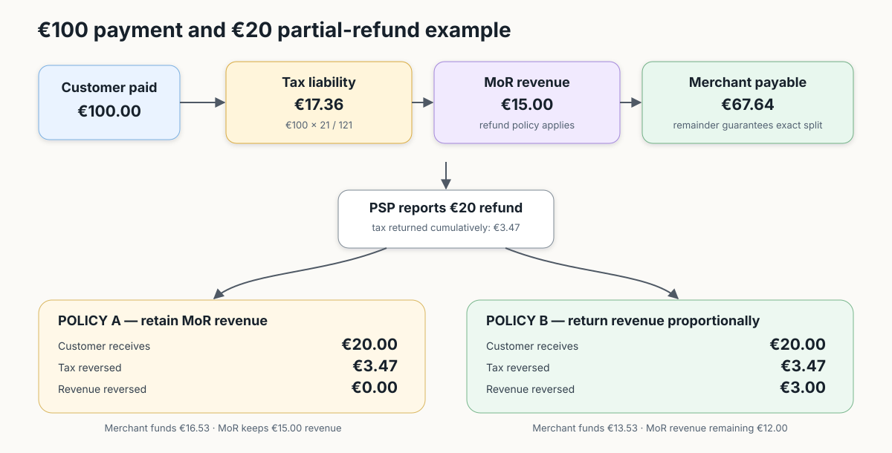

# Ledger business rules

This document explains the business behaviour of the Merchant of Record (MoR)
ledger. It deliberately separates what the application implements today from
the controls that a production service still needs.

## Service boundary

The ledger records financial facts after the PSP has moved, or confirmed that
it will move, customer money. It does not decide whether a customer deserves a
refund and it does not initiate customer refunds.

The ledger owns:

- authenticated, idempotent ingestion of payment and refund notifications;
- immutable payment/refund facts and balanced ledger postings;
- tax, MoR revenue, merchant and held balances;
- cumulative allocation across multiple partial refunds;
- balances used by payout and tax-settlement processes;
- an audit trail and, in the target design, an exception queue.

Checkout, subscription and refund-orchestration services own customer-facing
validation, eligibility and the PSP refund call. A payout integration owns the
actual bank transfer after the ledger calculates what is payable.

## Non-negotiable invariants

1. A valid PSP money fact is never silently lost.
2. Every ledger transaction balances to zero per currency.
3. A PSP reference is idempotent: a retry cannot create another money movement.
4. Recorded amounts, tax evidence and tax rate are historical facts and do not
   change. Corrections are new ledger transactions.
5. `HELD` money is recorded but cannot be paid to a merchant.
6. Money uses `BigDecimal`; EUR input has at most two decimal places and final
   postings use `HALF_EVEN` rounding.

## Payment capture

A capture notification means that the PSP has already accepted the payment.
The ledger therefore distinguishes malformed transport from business problems:

| Situation | Behaviour | Current status |
|---|---|---|
| Bad signature or unreadable schema | Return `401`/`400`; no trustworthy event is available | Implemented |
| First valid PSP reference | Store payment and balanced entries atomically | Implemented |
| Exact retry | Return `200`; write nothing | Implemented |
| Unknown merchant | Store as `HELD`; do not lose or pay it | Implemented |
| Tax country/rate cannot be resolved | Store as `HELD` for review | Implemented |
| Same reference, different payment data | Preserve the first fact and create a manual exception | First fact is preserved; exception table is planned |
| Unsupported currency or other parseable business anomaly | Preserve the raw notification, then route it to review | Planned; the typed API currently rejects unsupported currency |

The production target is **acknowledge after durable storage**, even when the
business allocation needs review. To achieve that for events the typed API
cannot parse, add a raw PSP-event inbox before domain mapping.

## Refunds

A successful refund notification is also a fact: the PSP has returned money to
the customer. Full and partial refunds are supported, including many partial
refunds against one payment.

### Allocation

Tax is allocated cumulatively:

`tax for this refund = rounded tax for cumulative refunded amount - tax already returned`

This prevents 1-cent refunds from losing tax through repeated rounding. Refunds
for the same payment take a short row lock and execute in sequence; refunds for
different payments remain concurrent.

MoR revenue follows a policy configured by refund reason:

| Refund policy | Partial refund | Full refund | Default reasons today |
|---|---|---|---|
| Retain revenue | Revenue is unchanged; merchant funds the remainder after tax | Revenue remains with the MoR | `CUSTOMER_REQUEST`, `PRODUCT_ISSUE`, `OTHER` |
| Return revenue | Return the proportional fee using cumulative allocation | Return the complete fee | `DUPLICATE`, `FRAUD` |

The current fee is percentage-based. A future hybrid fee must store fixed and
variable components separately: variable revenue can be returned proportionally;
a fixed transaction fee should be either non-refundable or reversed by a
separate adjustment when the payment becomes fully refunded.

### Ordering and exceptions

| Situation | API behaviour now | Production handling |
|---|---|---|
| Refund arrives before payment | `404`; nothing is stored | Caller retries. Safer option: persist a pending raw event and retry automatically |
| PSP reports `success=false` | Return `200`; no monetary posting | Keep operational log/metric |
| Exact refund retry | Return `200`; write nothing | No manual action |
| Same refund reference with different data | Preserve original, return idempotent response and log | Save exception for manual investigation |
| Cumulative refund exceeds captured amount | Record the already-happened fact and log | Move excess to suspense/exception workflow; never discard a successful PSP event |
| Currency mismatch, impossible timestamp or broken invariant | Do not guess | Persist raw event, alert and require correction transaction/manual resolution |

The exception table and operator workflow are not implemented. A useful minimal
state model is `NEW -> RETRYABLE | MANUAL_REVIEW -> RESOLVED`, retaining the raw
payload, reason, references, attempts and resolution transaction.

## Payouts and tax settlement

### Merchant payout

Target behaviour:

- At the end of each London business day, calculate each merchant's positive
  `MERCHANT` balance. Exclude `HELD` funds.
- Create one idempotent payout instruction per merchant and business date.
- A payout integration sends it and reports `SENT`/`CONFIRMED`; the core ledger
  should not pretend that a computed payout is already transferred.
- A non-positive balance is carried forward and future sales offset it.
- If a merchant remains negative for 14 days, alert operations. Recovery can be
  a merchant top-up, an authorised debit, a reserve, or a contractual invoice.

The payout tables exist, but scheduling, transfer calls, confirmation and the
14-day negative-balance workflow are not implemented. Hourly payout can later
replace daily payout by changing the idempotency period and processing shards in
parallel; it does not require changing capture/refund accounting.

### Tax settlement

Tax accrues in ledger accounts per country and is paid asynchronously according
to each jurisdiction's filing calendar, commonly monthly. Capture/refund APIs do
not call a tax authority.

Target tax-rate flow:

- a tax/regulation service publishes versioned rates with `valid_from`;
- the ledger validates and stores the new version, then refreshes a local cache;
- capture selects the rate effective at `payment_time` and freezes that rate on
  the payment;
- refunds reverse the frozen original tax, never today's rate;
- the monthly tax job settles the country balance idempotently and records the
  resulting ledger transaction.

The schema includes a versioned tax-rate table, but the current application uses
an in-memory standard-rate map. Cache refresh, tax-service ingestion and monthly
settlement are planned.

## Reliability and reconciliation

- Respond `200` only after the database transaction commits.
- Use database uniqueness for idempotency, not a read-then-write check.
- Reconcile captured/refunded PSP totals against the ledger every day.
- Alert on missing events, duplicate conflicts, over-refunds, prolonged negative
  merchant balances and payout/tax settlement mismatches.
- Production availability needs PostgreSQL failover, backups with restore tests,
  multiple stateless application instances and observable retry/error queues.
- Multi-region active/active writes are unsafe without a single owner for each
  payment or a globally serializable ledger; start with one write region.

## Capacity statement

Ledger capacity is measured in **financial events per second**, not directly in
MAU/DAU. The current code has short PostgreSQL transactions and a 10-connection
pool, but it has no load-test result, so an exact supported-user claim would be
misleading.

For planning only, if one active user creates three ledger events per day:

| Sustained event rate | Events/day | Approximate DAU | Approximate MAU at 20% DAU/MAU |
|---:|---:|---:|---:|
| 10 events/s | 864,000 | 288,000 | 1.44 million |
| 50 events/s | 4.32 million | 1.44 million | 7.2 million |
| 100 events/s | 8.64 million | 2.88 million | 14.4 million |

These are conversions, not benchmarks. Before making an SLA, run concurrent
capture/refund tests against production-like PostgreSQL, including hot merchants,
row-lock contention, idempotent retries and payout/report queries. Scale first
with stateless replicas and a larger pool, then balance snapshots/partitioning,
and finally merchant-based shards with tax aggregation across shards.

## Hardest parts and open decisions

The difficult parts are event ordering, cumulative rounding, exactly-once
effects, negative merchant recovery, PSP reconciliation and versioned tax rules.
The following decisions should be confirmed before production:

1. Should a refund that arrives before its payment rely on PSP retry, or be
   durably stored in a pending-event inbox?
2. Should unsupported currency be rejected, held, or stored only as a raw event?
3. Which refund reasons return percentage revenue, and is this configurable per
   merchant/product?
4. Will a fixed MoR fee exist, and is it non-refundable or returned only after a
   full refund?
5. Where should an over-refund be posted while operations investigates: merchant,
   MoR loss, or a dedicated suspense account?
6. What contract authorises recovery after a merchant remains negative for 14
   days?
7. Which service owns payout/tax retries and which external confirmation makes a
   settlement final?
