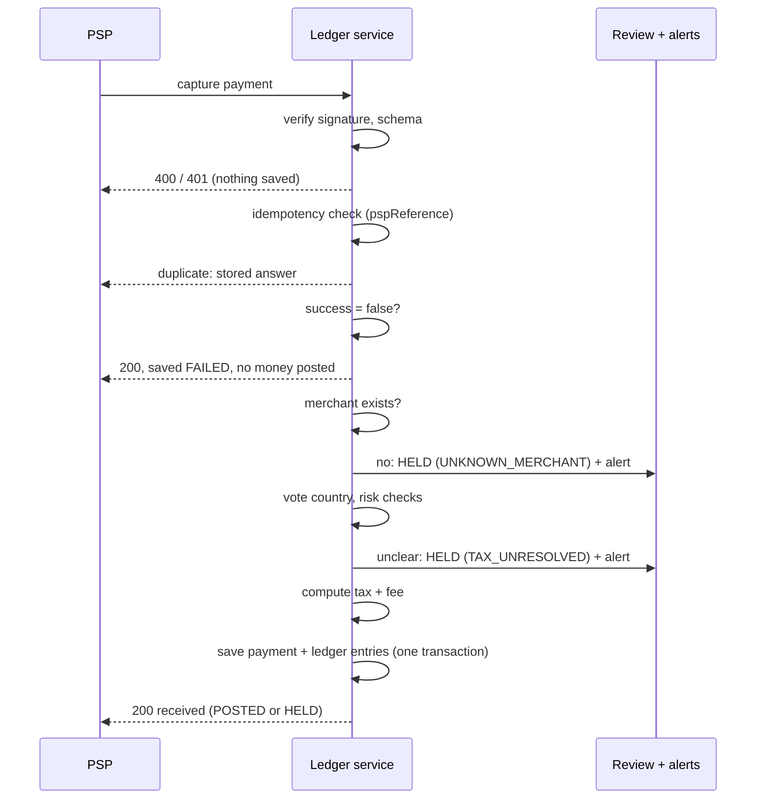
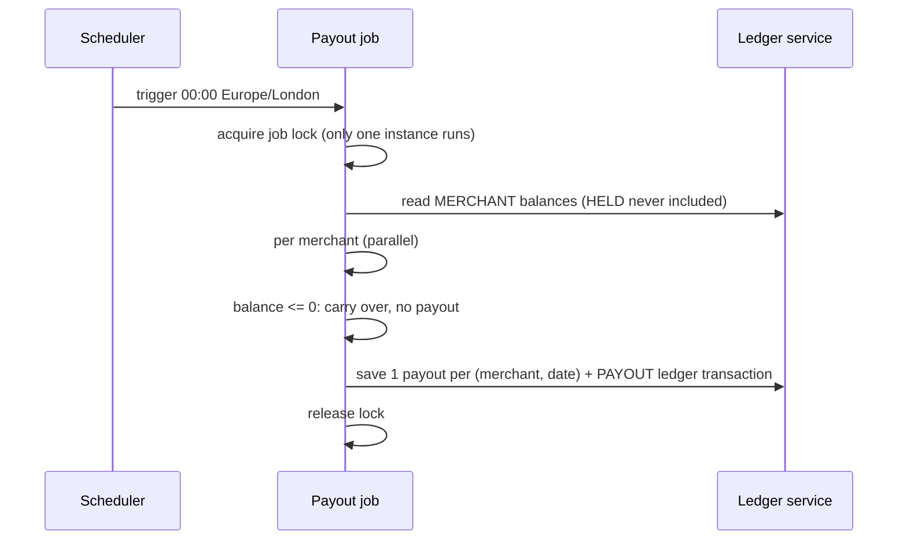
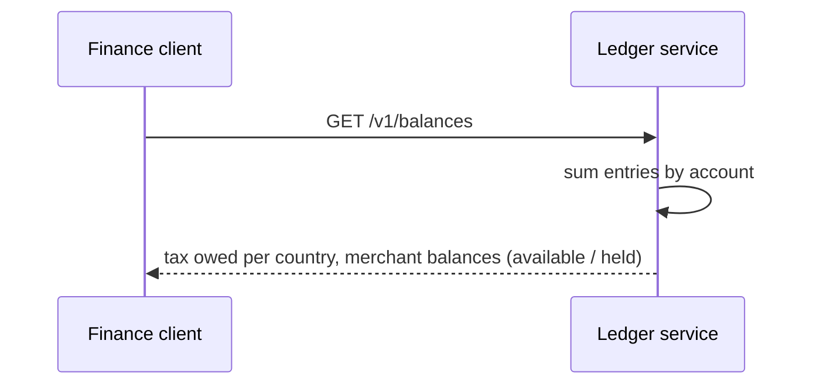
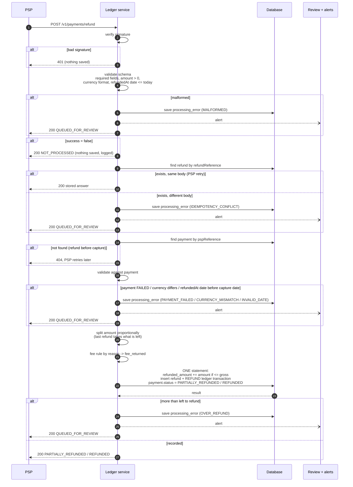
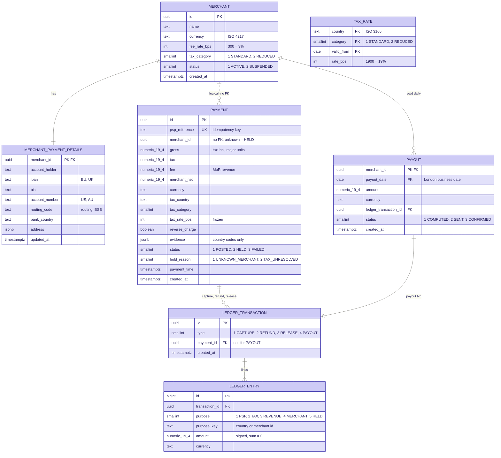

# MoR Ledger

Merchant of Record ledger. Records captured payments, derives what we owe
tax authorities and what we owe merchants.

**To build and run it, see [README_RUN.md](README_RUN.md).** This file is the
design: tax rules, schema, trade-offs and limits.

**For a short interviewer-facing view with rendered diagrams, see
[BUSINESS_RULES.md](BUSINESS_RULES.md).**

> Sections are added as the design is agreed.

## Scope

- Digital goods and services only (software, SaaS, courses, content).
  No physical goods, no shipping address.
- Tax follows the **customer's country of residence**, never the merchant's.

## Tax logic

Tax is decided in 3 steps.

### 1. Find the customer's country (vote)

The PSP and checkout give us up to 3 signals:

| Signal | Source | Can be wrong because |
|---|---|---|
| `billingAddress.country` | PSP | customer typed it |
| `cardIssuingCountry` | PSP (card BIN) | old card, moved abroad |
| `ipCountry` | checkout, via PSP metadata | VPN, travelling |

Rules:

- The country with **at least 2 matching signals** wins
  (EU rule: 2 non-contradictory pieces of evidence).
- All 3 differ, or only 1 signal present: **billing country wins**,
  conflict is logged for review.
- The evidence is stored with the payment and never changes, even if the
  customer moves later.

Examples:

| Billing | Card | IP | Tax country | Why |
|---|---|---|---|---|
| ES | ES | ES | ES | all agree |
| ES | AU | ES | ES | 2 of 3 |
| AU | AU | ES | AU | tourist in Spain, lives in Australia |
| ES | AU | FR | ES | no majority, billing wins, logged |

### 2. Customer type

| Condition | Treatment | Tax we charge |
|---|---|---|
| no `customerVatId` | B2C | standard rate of tax country |
| `customerVatId` present, cross-border | B2B reverse charge | 0%, buyer self-accounts |

### 3. Country -> rate

Standard rates, kept in config (basis points, 1900 = 19%).
Verify against official sources before production use.

| Country | Rate |
|---|---|
| DE | 19% |
| FR | 20% |
| ES | 21% |
| IT | 22% |
| NL | 21% |
| PL | 23% |
| IE | 23% |
| SE | 25% |
| GB | 20% |
| NO | 25% |
| AU | 10% (GST) |
| JP | 10% |

Country not in the table: see open decisions.

### Computing the split

`amount` from the PSP is **tax-inclusive** (what the customer paid).
API amounts are decimal major units and must match the currency precision
(EUR: at most 2 decimal places). Kotlin uses `BigDecimal`; PostgreSQL uses
`numeric(19,4)`. Values are stored at scale 4 and calculated postings are
rounded to the currency precision with `HALF_EVEN`.

```
tax         = round_half_even(gross * rateBps / (10000 + rateBps))
fee         = round_half_even((gross - tax) * feeBps / 10000)
merchantNet = gross - tax - fee          # remainder absorbs rounding
```

Invariant: `gross = tax + fee + merchantNet`.

Example: 121.00 EUR, customer in ES (21%), MoR fee 3%

```
tax         = 21.00  -> owed to ES tax authority
fee         =  3.00  -> MoR revenue
merchantNet = 97.00  -> owed to merchant
```

## Out of scope (documented, not implemented)

- US sales tax (state and local rates, digital goods taxability varies by state).
- Tax category per product (only per merchant is implemented).
- Registration thresholds: we assume the MoR is registered in every country in the rate table.
- VAT id validation (VIES).

## Architecture

Two independent flows plus one read endpoint.

### 1. Capture (API, synchronous)

The PSP already took the money. The webhook is a **notification, not a
request for permission**, so after capture we never reject valid money:
we record it and decide where it sits.



Why synchronous: split is pure math, posting is a few inserts in the same
transaction (~1-2 ms). No worker, no retries, balances correct right after
the answer. Condition: ledger entries are **append-only inserts**, never
`UPDATE balance`, so busy accounts do not lock.

### 2. Daily payout (scheduled job)

Runs at 00:00 `Europe/London` (time zone, not fixed UTC offset: DST).
Merchants are not paid per payment: per-payment transfers cost fees and
money is gone before a refund arrives.



### 3. Balances report (API)



### States

| Object | States (stored as smallint) |
|---|---|
| Payment | 1 `POSTED`, 2 `HELD`, 3 `FAILED` |
| Payout | 1 `COMPUTED`, 2 `SENT`, 3 `CONFIRMED` |

Enums are stored as `smallint`, not text: every enum implements `EnumId`
(`val id: Short`) and the id is what goes in the column. Smaller rows and
smaller indexes at ledger volume. The cost is that a raw `SELECT` is no
longer self-explaining - the mapping lives in the enum class and in the
column comment, and a reporting view should join the labels back.

### HELD

HELD = money is **recorded but frozen**. It shows in balances as `held`,
the payout job skips it, a human reviews it.

| Reason | Trigger | Where the money sits |
|---|---|---|
| `UNKNOWN_MERCHANT` | merchant not in our system | ledger account `HELD`, key null |
| `TAX_UNRESOLVED` | country vote fails / country not in rate table | ledger account `HELD`, key = merchant |
| `RISK` (future) | fraud signals | merchant held balance |
| `SANCTIONS` (future) | embargoed country | merchant held balance, compliance |

Review outcome: **release** (moves to available, paid next night) or
**refund** (new refund transaction to the customer).

### Validation: where each check belongs

| Before capture (checkout / PSP) - can reject | After capture (ledger) - record or hold |
|---|---|
| fraud score, 3-D Secure | signature, schema -> reject 401 / 400 |
| merchant active, verified | duplicate -> stored answer |
| sanctions | unknown merchant -> HELD |
| amount limits | country vote fails -> HELD |

## Refund

The ledger **records** refunds, it does not decide them. Approval (refund
policy, fraud review) happens earlier, in another service: the MoR approves,
calls the PSP, the PSP returns the money to the customer's card, then the
PSP calls the ledger. By then the money is already gone, so the ledger
never declines a refund.

- **One endpoint**: the PSP calls `POST /v1/payments/refund`. Same pattern
  as capture: signature, schema, idempotency, one database round trip.
- **Full and partial refunds.** One payment can have many refunds; a full
  refund is simply a partial refund of 100%.
- The customer always gets back exactly the refunded amount. Who bears our
  fee is between the MoR and the merchant; the PSP and the customer do not
  see it.

### API

```
POST /v1/payments/refund
Header: X-Signature   HMAC of the raw body, PSP shared secret
```

Request (normalized): what the PSP sends, mapped from its own format
(Adyen `REFUND` notification, Stripe `refund` object):

```
refundReference   string     required  refund's own PSP id, new for every refund, idempotency key
pspReference      string     required  original payment's PSP id, lookup key
amount            int64      required  minor units, > 0, <= what is left to refund
currency          string     required  ISO 4217, must equal payment.currency
success           boolean    required  false = refund failed at the PSP: not processed
reason            enum       optional  DUPLICATE / FRAUD / CUSTOMER_REQUEST /
                                       PRODUCT_ISSUE / OTHER (missing = OTHER)
refundedAt        date-time  required  when the PSP refunded
```

Example:

```json
{
  "refundReference": "9915116497253970",
  "pspReference": "8835116497253962",
  "amount": 5000,
  "currency": "EUR",
  "success": true,
  "reason": "CUSTOMER_REQUEST",
  "refundedAt": "2026-09-25T09:30:00Z"
}
```

Responses:

| Code | When | Body |
|---|---|---|
| 200 | refund recorded | `{"status": "PARTIALLY_REFUNDED"}` or `{"status": "REFUNDED"}` (payment status after the refund) |
| 200 | `success = false` | `{"status": "NOT_PROCESSED"}`, nothing saved |
| 200 | same `refundReference` again | the stored answer |
| 200 | cannot be booked (see *Error handling*) | `{"status": "QUEUED_FOR_REVIEW"}`, saved to `processing_error`, alert raised |
| 401 | bad signature | problem details, nothing saved |
| 404 | payment not found (PSP retries later) | problem details, nothing saved |
| 5xx | database down, timeout | PSP retries |

Queued for review: malformed body, same `refundReference` with a different
body, amount more than left to refund, payment `FAILED`, currency differs,
`refundedAt` date after today or before the capture date. A PSP retry
cannot fix these, so we answer 200 to stop pointless retries and keep the
event for a human.

`reason` must come from our side (the MoR's refund service, via PSP
metadata), never typed by the merchant. Stripe's own refund reasons
(`duplicate`, `fraudulent`, `requested_by_customer`) map directly.

### Flow

```
1. verify signature                    -> 401
2. validate schema                     -> error table, 200 QUEUED_FOR_REVIEW
3. success = false                     -> nothing saved, logged, 200 NOT_PROCESSED
4. find refund by refundReference      -> same body: stored answer, 200
                                          different body: error table, 200
5. find payment by pspReference        -> not found: 404, PSP retries
6. validate against payment            -> error table, 200
7. split amount proportionally, apply fee rule
8. save refund + payment update + ledger (one statement)
                                       -> more than left: error table, 200
                                          recorded: 200
```



**Date checks compare days, not timestamps** (UTC dates):

- `refundedAt` date >= `capturedAt` date: same day is fine, a refund dated
  before its payment's day is impossible -> error table.
- `refundedAt` date <= today -> otherwise error table.
- Both times come from the PSP, so clock skew is tiny; comparing days avoids
  false rejections from seconds of skew. Rare edge left: capture 00:00:01,
  refund stamped 23:59:59 the previous day. Accepted.

**Database trips:** capture needs one; refund needs three (retry lookup,
payment lookup, final statement) because it validates against stored data
first. The retry lookup could move into the final statement later, like
capture.

**`success = false`** means the refund did not happen at the PSP.
It is a final fact, not a delivery error, so the PSP will not retry it.
Answering an error would make the PSP redeliver the same message for
nothing. When the MoR retries and it succeeds, a new `refundReference`
arrives and is recorded normally. The `refund` table therefore has no
status column: every row is a successful refund. Failed attempts live only
in the logs.

**Payment lookup.** Uses the unique index on `payment.psp_reference`.
The payment row holds everything frozen at capture: gross, tax, fee,
merchant net, tax country, tax rate. No tax is recalculated, even if the
country's rate changed since. PSP webhooks can arrive out of order (refund
before capture), so 404 is safe: the PSP retries, and by then the capture is
recorded.

**Over-refund guard.** One atomic update, so two refunds arriving at the same moment
can never together exceed the payment:

```
UPDATE payment SET refunded_amount = refunded_amount + :amount
WHERE id = :paymentId AND refunded_amount + :amount <= gross
-> 0 rows = more than what is left
```

### Split: tax follows the money

Each refund takes its proportional share of the capture's tax and fee,
immediately. Tax is owed only on what the customer finally keeps.

```
tax part  = amount x payment.tax / payment.gross
fee part  = amount x payment.fee / payment.gross
merchant  = amount - tax part - fee part
```

- **The last refund** (the one that brings `refunded_amount` to `gross`)
  takes exactly what is left of tax, fee and merchant net. Rounding can
  never leave a cent behind: all refunds together always equal the capture.
- **No waiting** for the total: a partial refund usually means the customer
  keeps the rest, so the total may never be reached. The money left the PSP
  today, so the ledger shows it today. Each refund has its own credit note,
  and the tax is reduced in the period of `refundedAt`.

Example: customer paid 50 USD with 20% tax inside (8.33).

```
refund 20  -> tax back 20 x 8.33 / 50 = 3.33   (we owe the country less)
kept   30  -> tax still owed          = 5.00   (the sale still exists for 30)
```

### Fee (MoR revenue) on refund

The reason decides whether we return our fee part:

| Reason | Whose fault | Our fee |
|---|---|---|
| `DUPLICATE` | ours (charged twice) | returned |
| `FRAUD` | ours (fraud checks missed it) | returned |
| `CUSTOMER_REQUEST` | merchant's refund policy | kept |
| `PRODUCT_ISSUE` | merchant | kept |
| `OTHER` / missing | unknown | kept (safe default) |

- The reason -> fee rule lives in **config**, not code.
- The decision (`fee_returned`) is **stored on the refund**, so a config
  change never rewrites history.
- Keeping the fee matches industry practice: large MoRs retain their
  processing fee on refunds. When the fee is kept, the merchant covers it.

### Writes (one statement, one round trip)

A successful refund writes three things together, or nothing:

1. insert into `refund`
2. update `payment.refunded_amount` and `payment.status`
   (`PARTIALLY_REFUNDED`, or `REFUNDED` when `refunded_amount = gross`)
3. insert a `REFUND` ledger transaction with its entries

```
refund
  id                uuid          PK
  refund_reference  text          UNIQUE, idempotency (PSP retry -> stored answer)
  payment_id        uuid          FK -> payment.id, many refunds per payment
  amount            bigint        <= what was left
  currency          text
  reason            text          DUPLICATE / FRAUD / CUSTOMER_REQUEST /
                                  PRODUCT_ISSUE / OTHER
  fee_returned      boolean       frozen decision: was our fee part returned
  refunded_at       timestamptz   from PSP
  created_at        timestamptz

  index (payment_id)              all refunds of one payment
```

- **`fee_returned` is frozen.** If the config says "FRAUD -> return fee"
  today and "keep fee" tomorrow, refunds made today stay `true` forever.

### Ledger entries

Append-only: the capture entries are never changed. Each refund adds a new
`REFUND` transaction with its share, signs reversed. Capture: 121 EUR,
Spain, tax 21, fee 3, merchant 97.

```
full refund, fee kept              full refund, fee returned
  PSP          -121                  PSP          -121
  TAX ES        +21                  TAX ES        +21
  MERCHANT X   +100                  REVENUE        +3
                                     MERCHANT X    +97

partial 50, fee kept
  PSP           -50
  TAX ES       +8.68
  MERCHANT X  +41.32    merchant covers its share and our kept fee part
```

- Tax owed to Spain goes down by the refund's tax part.
- Fee kept: the merchant covers the fee part.
- Refund of a `HELD` payment: the lines go to the same accounts the capture
  used (`HELD` instead of `MERCHANT`, same key). Rule: **a refund mirrors
  the capture's own ledger lines, proportionally, signs flipped.**

### Effect on merchant balance and payout

The refund lowers the merchant's `MERCHANT` balance. The nightly payout
simply sees the lower balance, no special refund logic:

```
Mon  capture 121          MERCHANT X balance   97
Tue  00:05 payout 97      balance               0
Wed  refund, fee kept     balance            -100   merchant owes us
Thu  new sales +60        balance             -40   no payout
Fri  new sales +70        balance             +30   payout 30
```

A negative balance is carried forward and recovered from future sales.

### Refunded more than paid

PSPs normally block refunding more than was captured. It still happens:

| Case | How | Frequency |
|---|---|---|
| refund + chargeback | merchant refunds, customer also disputes with the bank: money goes out twice | most common |
| unreferenced refund | some PSPs allow a refund (credit) not linked to any payment | rare |
| PSP or our bug | lost or duplicated event | rare |

The money has already moved, so the strictly correct handling is **record
it and hold it for review**, never reject. The guard saves the event to
`processing_error` (`OVER_REFUND`) and answers 200; a human resolves it
with the PSP. Chargebacks are a
separate event type with their own check (not implemented).

### Refund failed later (not implemented)

A refund can fail **after** it succeeded: Adyen can send `REFUND_FAILED`
days later (e.g. the card no longer exists). The money comes back to us, so
the ledger would have to reverse the refund with a new transaction.
Documented, not handled.

## Error handling

Some PSP events cannot be booked: the data is wrong or contradicts what we
stored. Rejecting them (4xx) makes the PSP retry for days, uselessly, and
the money has already moved. Instead we **save the raw event, alert, and
answer 200**. A human resolves it later.

### What goes where

| Situation | Where | Answer |
|---|---|---|
| Bad signature | nothing saved: could be an attacker spamming our DB | 401 |
| Refund before its capture arrived | nothing saved: a PSP retry fixes it | 404 |
| Database down, timeout | nothing saved: temporary | 5xx, PSP retries |
| Unknown merchant, tax unresolved (capture) | `payment` as `HELD`: amounts are known, money is booked, only the owner is unclear | 200 |
| Data wrong or contradictory | `processing_error`: cannot be booked at all | 200 `QUEUED_FOR_REVIEW` |

Rule: **store only what a retry cannot fix.** `HELD` is for money we can
book; `processing_error` is for events we cannot book.

### Table

```
processing_error
  id                  uuid          PK
  event_type          text          CAPTURE / REFUND
  external_reference  text          pspReference or refundReference
  payload             jsonb         raw request, exactly as received
  error_code          text          see below
  error_detail        text          human-readable
  status              text          OPEN / RESOLVED / IGNORED
  resolution_note     text  null    what the human did
  resolved_at         timestamptz   null
  created_at          timestamptz

  UNIQUE (event_type, external_reference, error_code)  PSP retries do not duplicate rows
  index (status) WHERE status = 'OPEN'                  review queue
```

### Error codes and resolution

Every error raises an alert. Resolution is **manual** for the task.

| error_code | Event | Meaning | Resolution |
|---|---|---|---|
| `MALFORMED` | capture, refund | valid signature, broken body | fix the PSP mapping, replay |
| `IDEMPOTENCY_CONFLICT` | capture, refund | same reference, different body | compare with the PSP, keep the correct version |
| `OVER_REFUND` | refund | more than left to refund (e.g. refund + chargeback) | manual request to the PSP, then book or write off |
| `PAYMENT_FAILED` | refund | refund of a payment whose capture failed | check with the PSP if the capture really failed |
| `CURRENCY_MISMATCH` | refund | refund currency differs from payment | manual with the PSP |
| `INVALID_DATE` | refund | refund dated after today or before its payment's day | verify dates with the PSP, replay if valid |

Resolving = the human fixes the cause, sets `status = RESOLVED` (or
`IGNORED`) with a `resolution_note`. Later: a **replay** action sends the
stored payload through the same endpoint again; endpoints are idempotent,
so replay is safe.

### Weakness

An open error means money moved at the PSP but **not** in our ledger:
balances and tax are off by that amount until resolved. Mitigation:

- alert on every new error, and again when one is **open more than 3 days**;
- the balances report shows "N open errors, total X" next to the balances;
- daily reconciliation with the PSP settlement report catches anything missed.

### Production (not implemented)

- Metrics (Prometheus) and dashboards (Grafana): errors per code, open
  errors, age of the oldest open error; alert rules per code.
- Automatic resolution for simple cases (e.g. auto-replay after a mapping
  fix), a review UI, replay button.

## Database

Table names are singular. Money is always exact `numeric(19,4)`, never binary
`float` or `double`.

### Tables overview



- Dotted line `MERCHANT` -> `PAYMENT`: logical link, no foreign key, so an
  unknown merchant can still be saved as HELD.
- `TAX_RATE` has no relations: reference data loaded into memory.

### Merchant

A merchant is the business we sell on behalf of. The MoR collects the
customer's money, keeps tax and its fee, and owes the rest to the merchant.

Rules:

- **One merchant = one legal company.** A company with entities in Australia
  and the US is two merchants (different legal entity, currency, bank).
- **One merchant = one payment details record** (1:1). Multiple bank
  accounts per merchant are out of scope.
- Merchants are **never created from PSP data**. A capture with an unknown
  `merchant_id` is stored as `HELD` (`UNKNOWN_MERCHANT`), not rejected and
  not auto-created.
- `status = SUSPENDED` stops payouts; captures are still recorded.
- `tax_category` decides which rate applies (SaaS = STANDARD, e-books =
  REDUCED in some countries). One category per merchant.
- `fee_rate_bps` is the MoR fee (revenue) rate. The fee actually charged is
  frozen on each payment, so changing the rate never changes history.
- Payment details are **sensitive**: kept in a separate table, encrypted,
  access-restricted. Ledger queries never touch them.

```
merchant
  id               uuid PK
  name             text
  currency         text          ISO 4217
  fee_rate_bps     int           300 = 3%
  tax_category     smallint      1 STANDARD, 2 REDUCED, see tax_rate
  status           smallint      1 ACTIVE, 2 SUSPENDED
  created_at       timestamptz

merchant_payment_details         one merchant = one payment details
  merchant_id      uuid PK, FK -> merchant.id
  account_holder   text          required by every bank transfer
  iban             text  null    EU / UK
  bic              text  null
  account_number   text  null    US / AU
  routing_code     text  null    US routing number / AU BSB
  bank_country     text          ISO 3166, may differ from merchant's country
  address          jsonb         account holder address, international transfers
  updated_at       timestamptz
```

Bank identifiers by country:

| Country | Required |
|---|---|
| EU, UK | IBAN + BIC |
| US | account number + routing number |
| Australia | account number + BSB |

Known limitations (documented, not implemented):

- Changing payment details overwrites the old ones. The payout should store
  which details it used (e.g. last 4 digits) for audit.
- Merchant tax id (VAT / EIN), legal address: needed in production for
  payout invoices and tax reporting on seller payouts.
- Per-merchant fee is kept; the task allows a single flat fee, real MoRs
  negotiate per merchant.

### Tax rate

Reference data: ~150 countries x 2 categories. Loaded into memory at
startup, never queried per payment.

One country can have several taxes:

| Type | Example | Handled |
|---|---|---|
| Over time | Estonia 22% -> 24% (July 2025) | yes, `valid_from` |
| By product category | DE: 19% standard, 7% e-books | yes, per merchant |
| Stacked taxes | Canada GST + provincial; US state + county + city | no, US/CA out of scope |

```
tax_rate
  country      text   PK   ISO 3166
  category     smallint PK 1 STANDARD, 2 REDUCED
  valid_from   date   PK   rate applies from this date
  rate_bps     int         1900 = 19%
```

Lookup for a payment:

```
country  = result of the country vote
category = merchant.tax_category
rate     = row with latest valid_from <= payment.payment_time
```

Rules:

- **Append-only.** A rate change is a new row with a future `valid_from`;
  old rows stay for audits.
- The rate used is **frozen on the payment** (`tax_rate_bps`). A rate change
  never touches past payments; a refund reuses the payment's rate.
- Country or category not in the table -> payment `HELD` (`TAX_UNRESOLVED`).
- The PSP knows nothing about product category (its merchant category code
  is the MoR's, the same for every payment). Category comes from our side.

Known limitations:

- **One category per merchant.** A merchant selling both SaaS and e-books
  must be registered as two merchants. Production: checkout sends the
  category per payment in PSP metadata.
- Rate changes at midnight in the country's own time zone; we compare by
  date of `payment_time` in UTC. Edge case, documented.

### Payment

One row per PSP capture event. The business fact: what the customer paid
and how it was split. Money movements live in `ledger_entry`.

```
payment
  id              uuid          PK
  psp_reference   text          UNIQUE, idempotency key
  merchant_id     uuid          no FK: unknown merchant -> HELD
  gross           numeric(19,4) customer paid, tax included, major units
  tax             numeric(19,4)
  fee             numeric(19,4) MoR revenue
  merchant_net    numeric(19,4)
  currency        text          ISO 4217
  tax_country     text          ISO 3166, result of the vote
  tax_category    smallint      1 STANDARD, 2 REDUCED, from merchant
  tax_rate_bps    int           frozen at capture
  reverse_charge  boolean       true -> tax = 0, B2B
  evidence        jsonb         {"billing":"ES","card":"AU","ip":"ES","vatId":null}
  status          smallint      1 POSTED, 2 HELD, 3 FAILED, only mutable column
  hold_reason     smallint null  1 UNKNOWN_MERCHANT, 2 TAX_UNRESOLVED
  payment_time     timestamptz   from PSP
  created_at      timestamptz   when we saved it

constraints
  CHECK gross = tax + fee + merchant_net
  CHECK gross > 0 AND tax >= 0 AND fee >= 0 AND merchant_net >= 0
  CHECK (status = 2) = (hold_reason IS NOT NULL)          -- 2 = HELD

indexes
  UNIQUE (psp_reference)             idempotency, one-statement insert
  (merchant_id, payment_time)         merchant history
  (status) WHERE status = 2          review queue, small partial index
```

Rules:

- **Idempotency = `psp_reference`.** The PSP's payment id is already unique;
  no separate token. A retry hits the unique constraint and returns the
  stored row, in the same single statement.
- **Frozen at capture:** amounts, rate, category, country. Only `status`
  (and `hold_reason`) change, e.g. HELD -> POSTED on release.
- `merchant_net` is derivable but stored for readability; the CHECK
  constraint guarantees it never disagrees.
- **No FK to `merchant`**: an unknown merchant must be stored as HELD, not
  fail the insert.
- **One table, not split.** 1:1 data, written in one insert, read together.
  Row ~250 bytes: ~90 GB/year at 1M payments/day. At high volume, partition
  by month on `payment_time`, not by columns.

Compliance:

- **PCI DSS: out of scope.** No card number, CVV or expiry is ever received
  or stored; only the card's issuing country. The PSP holds card data.
- **GDPR: data minimisation.** Evidence is stored as country codes only; no
  full billing address, no raw IP.
- **Retention: 10 years.** Required by tax law (proof of customer country);
  GDPR allows it as a legal obligation.

### Ledger

`payment` says **what happened**. The ledger says **whose money it is**.
Every money event (capture, refund, release, payout) is one
`ledger_transaction` with 2+ `ledger_entry` lines that sum to zero.

Why not just sum the `payment` table: refunds, HELD releases, payouts and
future events (chargebacks, adjustments) are money movements, not payments.
Without a ledger, every new event type is a new table and every balance
query changes. With it, every balance is one query:
`SUM(amount) per (purpose, purpose_key, currency)`.

An entry's **purpose** says whose money the line is, not which bank account
it sits in. All money physically sits in our PSP balance.

| id | purpose | purpose_key | Meaning |
|---|---|---|---|
| 1 | `PSP` | - | money that came in / went out via the PSP |
| 2 | `TAX` | country | owed to that country's tax authority |
| 3 | `REVENUE` | - | MoR fee |
| 4 | `MERCHANT` | merchant id | owed to the merchant, paid out nightly |
| 5 | `HELD` | merchant id, or null for unknown merchant | frozen, never paid out |

```
ledger_transaction                  one money event
  id            uuid          PK
  type          smallint      1 CAPTURE, 2 REFUND, 3 RELEASE, 4 PAYOUT
  payment_id    uuid  null    FK -> payment.id, null for PAYOUT
  created_at    timestamptz

  indexes
    (payment_id)                    all movements of one payment

ledger_entry                        one line = one change in "whose money"
  id              bigint      PK, auto-increment
  transaction_id  uuid        FK -> ledger_transaction.id
  purpose         smallint    1 PSP, 2 TAX, 3 REVENUE, 4 MERCHANT, 5 HELD
  purpose_key     text  null  TAX: country, MERCHANT: merchant id,
                              HELD: merchant id or null
  amount          numeric(19,4) signed, + debit / - credit, major units
  currency        text        ISO 4217

  constraints
    CHECK amount <> 0
    SUM(amount) per (transaction_id, currency) = 0   checked in code before insert
  indexes
    (purpose, purpose_key, currency)        balances
    (transaction_id)
```

Examples:

```
CAPTURE  121 EUR, Spain, POSTED      CAPTURE  121 EUR, unknown merchant, HELD
  PSP                +121              PSP              +121
  TAX      ES         -21              TAX      ES       -21
  REVENUE              -3              REVENUE            -3
  MERCHANT X          -97              HELD     null     -97

RELEASE  (HELD -> merchant X)        PAYOUT   merchant X, balance 97 EUR
  HELD     X          +97              MERCHANT X        +97
  MERCHANT X          -97              PSP               -97
```

Rules:

- **Append-only.** No update, no delete. Mistakes are fixed with new
  transactions.
- **Two tables, not one.** Transaction type and payment id are stored once,
  not repeated on every line. Both inserts go in the same single statement
  as the payment: still one database round trip.
- **Payout = current `MERCHANT` balance**, then a PAYOUT transaction brings
  it to zero. No "paid up to entry id" bookmark: auto-increment ids are
  assigned at insert but committed out of order, so a bookmark can skip an
  entry forever. With balances, a late entry is simply paid the next night.
- `HELD` is never paid out. A review releases it (RELEASE transaction) or
  refunds it.
- **Hot accounts do not lock**: only inserts, never `UPDATE balance`.
- **Size:** 4 lines per capture, ~60 bytes each: ~250 MB/day at 1M
  payments/day plus indexes. Partition by month; balance snapshots at
  high volume.

Multi-currency (designed, not implemented; task allows single currency):

- Balances are always per currency; never add different currencies together.
- Convert **at payout**, not at capture: one conversion per merchant per
  day, no exchange-rate call in the capture path.
- Conversion is its own ledger transaction (type `FX`, with `fx_rate`),
  through an `FX` account that collects exchange gains and losses:

```
FX  merchant X, 97 EUR -> USD at 1.08
  MERCHANT X   EUR   +97
  FX           EUR   -97
  FX           USD  +104.76
  MERCHANT X   USD  -104.76      sum = 0 per currency
```

### Payout

Once per day the job pays each merchant its `MERCHANT` balance. Merchants
are never paid per payment: every bank transfer costs a fee and money must
stay available for refunds.

```
payout
  merchant_id            uuid         PK, FK -> merchant.id
  payout_date            date         PK, business day, Europe/London
  amount                 numeric(19,4) MERCHANT balance at job time
  currency               text
  ledger_transaction_id  uuid         FK -> the PAYOUT ledger transaction
  status                 smallint     1 COMPUTED (2 SENT, 3 CONFIRMED later)
  created_at             timestamptz  when the job computed it

  PK (merchant_id, payout_date)       a rerun can't pay twice
```

Job:

```
00:05 Europe/London, one instance (job lock)
for each merchant with MERCHANT balance > 0:
  BEGIN
    insert payout                       <- key conflict = already paid, skip
    insert PAYOUT ledger transaction:   MERCHANT +X, PSP -X
  COMMIT
balance <= 0 -> no payout, carried forward (refunds exceeded sales)
```

Idempotency, three layers:

1. **One DB transaction per merchant.** Payout row and ledger entries are
   saved together or not at all; a crash never leaves half a payout. The
   job commits merchant by merchant, so a rerun resumes where it died.
2. **Primary key `(merchant_id, payout_date)`.** A second insert for the
   same day is impossible, even with two job instances running at once.
   The job lock is an optimisation; the key is the guarantee.
3. **Balance is zero after payout.** The PAYOUT transaction brings the
   `MERCHANT` balance to 0, so a rerun computes nothing to pay.

```
run 1:  A committed   B committed   C crash (rolled back)
run 2:  A conflict -> skip   B conflict -> skip   C committed
```

Time zones:

- `payout_date` is the **London business date**, not the UTC date: 00:05
  London is 23:05 UTC the previous day in summer.
- Anything finer than a day (hours) must be stored in **UTC**. London local
  hours repeat once a year and skip once a year (clock changes), so a
  local-hour key would lose or merge an hour of money.

Design notes:

- **Composite primary key** keeps the one-payout-per-day rule in the key
  itself. More frequent payouts (hourly, manual extra payouts) or a bank
  transfer integration need a surrogate `id` primary key, with the
  frequency rule moved to a unique constraint. The `id` would also be the
  idempotency key sent to the bank.
- **Balance = plain `SUM`** of the merchant's entries. Fine up to ~10M
  payments/day. At ~100M/day add **hourly totals** per account (stored by
  UTC hour, with a completed-hours marker table); the payout then reads
  totals + raw entries after the last completed hour, so a stuck hourly job
  only slows payouts, never makes them wrong.
- Payout is only **computed**. Sending money to the merchant's bank is a
  separate integration (status SENT / CONFIRMED).

## Operational concerns (documented, not implemented)

- **Negative balance**: refunds exceed sales -> no payout, balance carried forward.
- **HELD release**: admin action to release or refund held payments.
- **Daily reconciliation**: compare our captured total with the PSP
  settlement report. Primary control of any MoR; mismatches alert.
- **Chargebacks**: customer disputes with their bank. Separate flow.
- **Actual money transfer**: payout job only computes; sending money to
  the merchant's bank is a separate integration.

## Scalability

Load is measured in **payments per second**, not customers.
Black Friday peak is assumed ~10x the daily average.

| Payments/day | Avg / peak TPS | Current design | What breaks | Fix |
|---|---|---|---|---|
| 1M | 12 / 120 | works as is | nothing | - |
| 10M | 120 / 1.2k | works | DB connections | connection pool, 2-4 app instances |
| 100M | 1.2k / 12k | needs changes | single DB writer; hot accounts (e.g. tax DE); report sums slow; nightly job too heavy | shard by merchant; balance snapshots; job per shard in parallel |
| 1B+ | 12k / 120k+ | redesign | sync posting cannot absorb spikes; idempotency data ~1B rows/day | durable queue in front (ack after enqueue, post async); purpose-built ledger DB; idempotency partitioned by day, dropped after 30 days; multi-region |

### Bottlenecks, in the order they hit

1. **Hot accounts.** Every German sale touches "tax owed to DE"; a big
   merchant touches its own balance. Row updates lock at ~500-1k/s.
   Solved by append-only entries; further by splitting an account into N sub-accounts.
2. **Balance report.** Summing all entries gets slow after ~100M entries.
   Periodic balance snapshots, then sum only entries after the snapshot.
3. **Single DB writer.** ~5-10k writes/s. Shard by merchant; tax accounts
   exist per shard, report aggregates across shards.
4. **Idempotency storage.** Grows with every payment. Partition by day,
   keep ~30 days (PSP retry window).
5. **Nightly job.** One run over all merchants gets long. Run per shard in
   parallel, or keep per-merchant daily totals continuously.

### Growth over the years

- Year 1 (up to ~10M/day): single Postgres, 2-4 stateless app instances. Current design.
- Growth (~100M/day): snapshots, sharding, read replica for reports.
- Global (1B+/day): queue-buffered ingest, dedicated ledger engine, multi-region.

Trade-off: synchronous posting is the right choice up to ~100M/day. At the
extreme tier the design goes back to queue + async. Simplicity is chosen
deliberately for the current load.

### Overload and rate limiting

- Capture webhook: no per-customer limit. Under overload return **429/503**:
  safe, the PSP retries for days, nothing is lost.
- Balances report: normal rate limit per client.

### Availability

- Answer 200 only after the transaction commits.
- PSP retries + idempotency cover our downtime.
- Database is the single point of failure: replica with automatic failover (not implemented).
