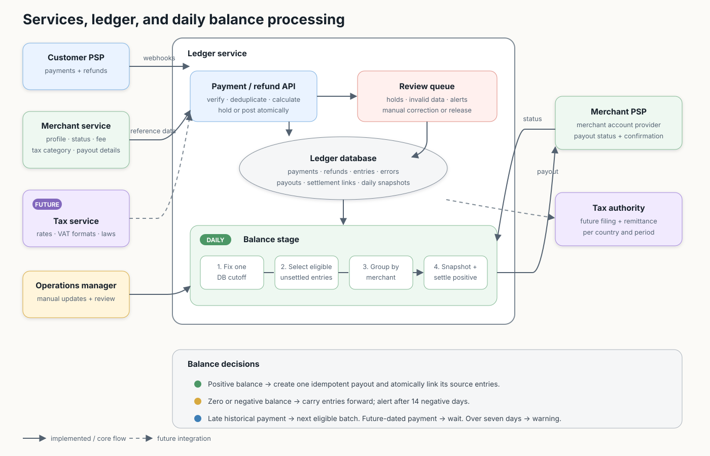
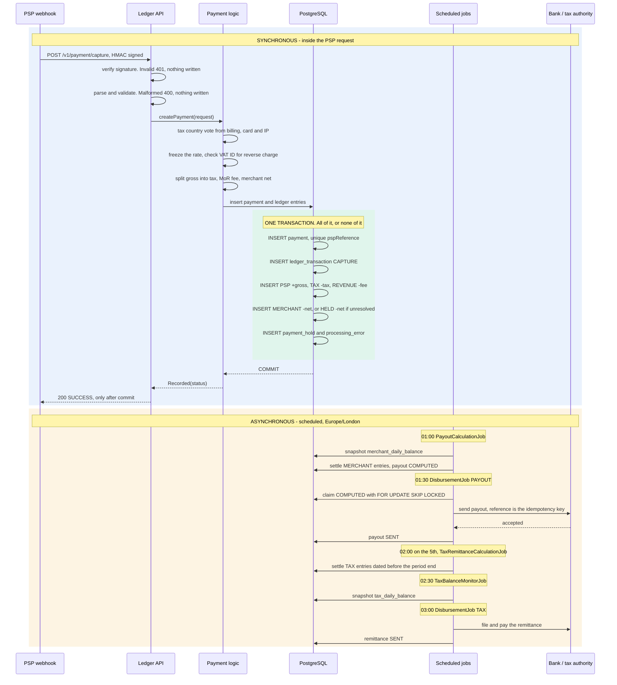
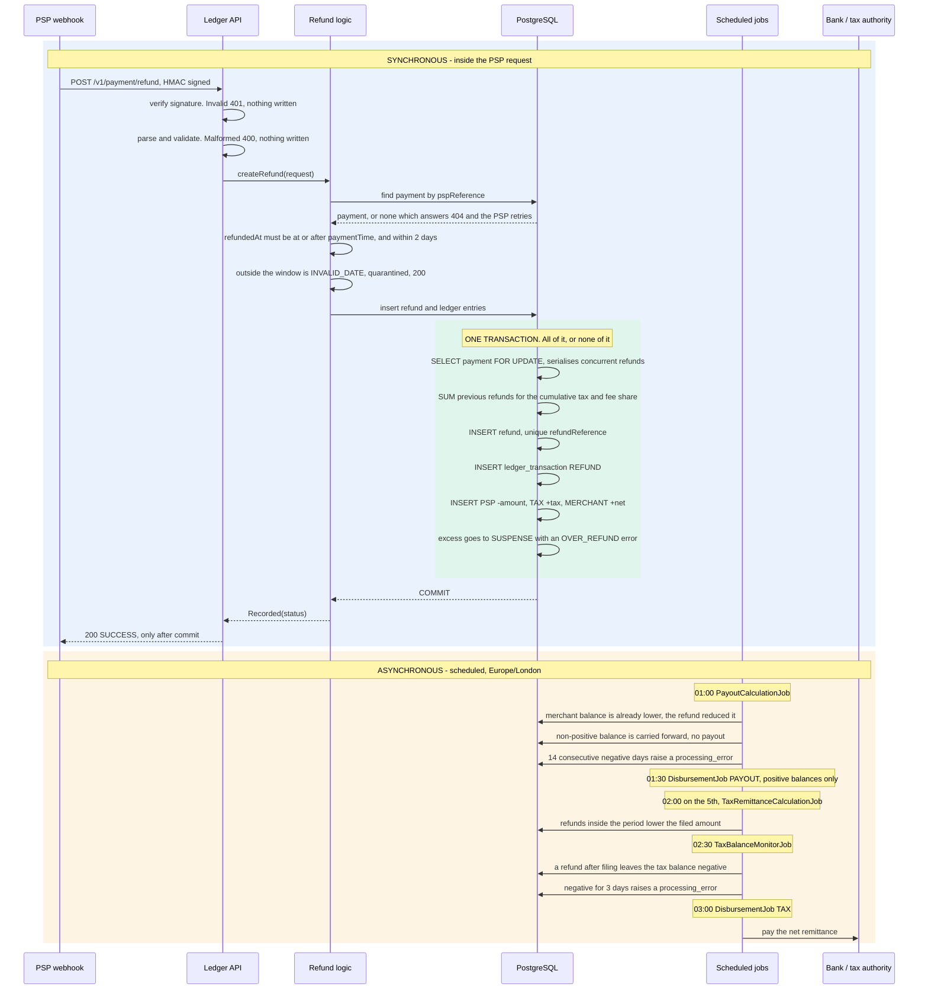
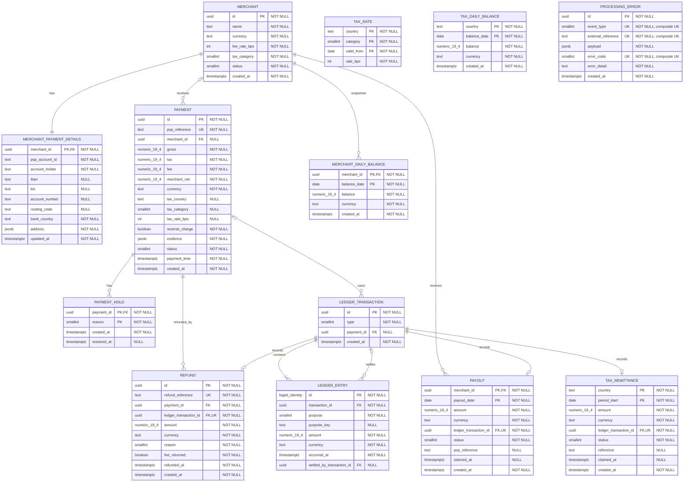

# Merchant of Record ledger     ~(=^・ω・^)ﾉ

For local run -> **[Run locally](README_RUN.md)**  

A Kotlin/PostgreSQL ledger for a Merchant of Record (MoR). It records PSP
payment and refund notifications, then derives tax liabilities and merchant
balances.

The PSP already moved the money before calling this service. The ledger records
that fact; checkout, fraud and refund approval happen earlier.

**Why a rolled-own ledger on PostgreSQL, not Formance or TigerBeetle:** the data
is relational - payments, refunds, merchants, quarantined events - so one
database keeps a payment, its ledger entries and its idempotency key in a single
transaction, and leaves room to grow the business rules and reporting around
them. A dedicated posting engine would be a second store to reconcile with.



### Capture, end to end



### Refund, end to end



## What is implemented

| Requirement      | Implementation                                                                 |
|------------------|--------------------------------------------------------------------------------|
| Capture payment  | Authenticated, atomic, idempotent posting                                      |
| Refund payment   | Full, partial, repeated and over-refunds                                       |
| Tax balance      | Current or period report per country                                           |
| Merchant balance | Live or daily-snapshot report with keyset pagination                           |
| Settlement       | Daily merchant payouts and monthly tax remittance using a mock transfer client |

One currency (EUR), one global MoR fee, and digital goods/services are assumed.

## Payments

`POST /v1/payment/capture`

| Event                          | Result                                           |
|--------------------------------|--------------------------------------------------|
| Successful capture             | Split into tax, MoR revenue and merchant balance |
| Unknown/suspended merchant     | Record payment; hold merchant money              |
| Tax cannot be resolved         | Record payment; hold money for review            |
| Exact retry                    | Return `200`; write nothing                      |
| Same reference, different data | Keep first event; save `IDEMPOTENCY_CONFLICT`    |
| `success=false`                | Return `200`; write nothing                      |
| Bad signature/body             | Return `401`/`400`; write nothing                |
| Internal error                 | Return `500`; write nothing                      |

Tax country uses billing, card and IP country evidence. Two matching signals
win; billing is the fallback. The selected rate and evidence are frozen on the
payment. Valid cross-border VAT ID format enables reverse charge; live VIES
validation is not implemented.

Money is exact: API amounts have at most two EUR decimal places, Kotlin uses
`BigDecimal`, PostgreSQL uses `numeric(19,4)`, and calculations use
`HALF_EVEN` rounding.

```text
tax         = gross × rate / (100% + rate)
fee         = (gross - tax) × configured fee
merchantNet = gross - tax - fee
```

## Refunds

`POST /v1/payment/refund`

| Event                          | Result                                                           |
|--------------------------------|------------------------------------------------------------------|
| Missing payment                | Return `404`; retry after capture arrives                        |
| Partial/full refund            | Record refund and balanced ledger entries                        |
| Multiple concurrent refunds    | Serialize on the payment row                                     |
| Exact retry                    | Return `200`; write nothing                                      |
| Same reference, different data | Keep first event; save `IDEMPOTENCY_CONFLICT`                    |
| Total exceeds payment          | Record full refund; put excess in `SUSPENSE`; save `OVER_REFUND` |
| Invalid refund date            | Save error; return `200`; do not book refund                     |
| Internal error                 | Return `500`; write nothing                                      |

Tax reversal uses cumulative allocation. Small refunds may initially reverse no
tax, later refunds catch up, and a full refund reverses exactly the original
tax despite cent rounding.

The current policy keeps MoR revenue on every refund. The merchant funds the
refund after tax reversal. `fee_returned` is frozen on each refund so a future
policy can safely change this behavior.

## Ledger and balances

Every money event creates one transaction with balanced entries:

| Account         | Meaning                       |
|-----------------|-------------------------------|
| `PSP`           | Cash received or returned     |
| `TAX:<country>` | Tax liability                 |
| `REVENUE`       | MoR fee                       |
| `MERCHANT:<id>` | Payable merchant money        |
| `HELD:<id>`     | Recorded but not payable      |
| `SUSPENSE:<id>` | Unresolved over-refund excess |

Accounting amounts are append-only. Payout and tax jobs only attach settlement
links to the exact source entries they consume.

Reports:

- `GET /v1/balances/tax` — current or period liability for one country.
- `GET /v1/balances/merchants` — available and held balance, live or by daily
  snapshot; default page 100, maximum 500.

Each report request uses one database snapshot. `occurred_at` is the PSP event
time, so late webhooks remain in the correct financial period.
Settlement transfer entries are excluded from these reports, so running a
payout or tax-remittance job does not erase the calculated business balance.

## Database schema



Colors group merchant data, tax data, balances and settlement, incoming money
events, and operational errors in the retained
[SVG version](docs/images/database-schema.svg). The Mermaid diagram above is
the README-native schema.

## Settlement

All times use `Europe/London`.

|               Time | Job                                                           |
|-------------------:|---------------------------------------------------------------|
|        Daily 01:00 | Snapshot balances and calculate previous-day merchant payouts |
|        Daily 01:30 | Send computed payouts                                         |
| Monthly, 5th 02:00 | Calculate previous-month tax remittances                      |
|        Daily 02:30 | Snapshot and monitor tax balances                             |
|        Daily 03:00 | Send computed tax remittances                                 |

Payout calculation reserves one `(merchant, date)` row, locks and settles only
eligible ledger entries, and leaves racing or late entries for the next run.
Non-positive and suspended merchant balances are not paid. Fourteen consecutive
negative days create an operational error.

The manual compute endpoints are repeatable while a batch is still `COMPUTED`:
newly arrived entries are appended to the existing payout or tax remittance.
A run with no new entries is a no-op; a batch already being sent is immutable.

Transfers use safe row claiming with `FOR UPDATE SKIP LOCKED`, a `PROCESSING`
state and stable receiver idempotency keys. The current transfer client always
accepts; no real money is sent.

## Reliability choices

- `200` only after database commit.
- Unique PSP/refund references prevent duplicate events.
- Changed duplicate payloads are preserved for review.
- Payment row locking protects cumulative refund allocation.
- Payout keys and source-entry locks protect concurrent job runs.
- Invalid but important money facts use durable `HELD`, `SUSPENSE` or
  `processing_error` records.
- PSP references are propagated through coroutine-aware logging context.

The write path is synchronous by design. A job runner is used for settlement,
not for API ingestion, keeping acknowledgement and durable posting in one
operation.

## Measured locally

Three one-minute mixed payment/refund runs used 32 workers, 10,000 preloaded
payments and 1,000 merchants. Median throughput was **738 requests/second**
with zero reported failures; median p95 was **191 ms**. Database invariants and
settlement results passed after each run.

This is laptop/Testcontainers evidence, not a production SLA. Rerun it with
`./gradlew mixedLoadTest` (needs Docker; not part of `test` or CI). See
[src/loadTest/README.md](src/loadTest/README.md) for the knobs.

## Current limits

- Runtime uses the global fee and `STANDARD` tax category; seeded merchant
  fee/category fields are not used for capture calculation.
- Tax and VAT rules are hardcoded Kotlin reference data; `tax_rate` is unused.
- EUR only.
- No hold/suspense resolution, chargebacks or failed-refund reversal.
- No real transfers, reconciliation or transfer confirmation.
- No distributed scheduler lock or missed-run recovery.
- Balance and development endpoints are unauthenticated.
- Merchant bank data is not application-encrypted.
